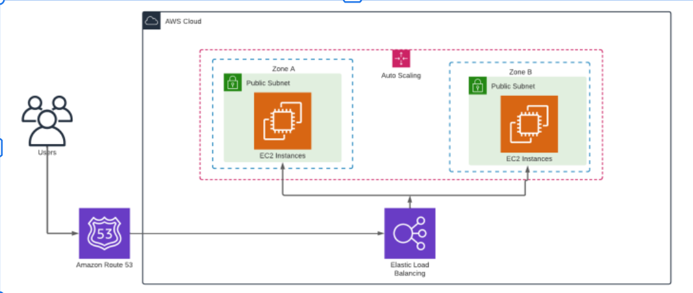
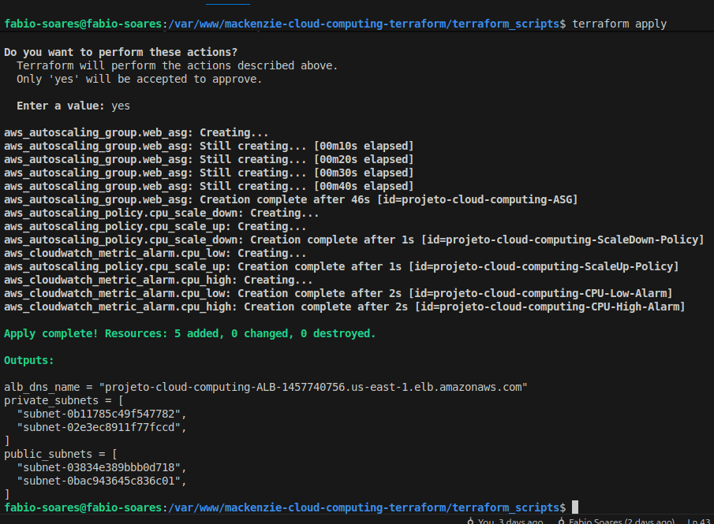
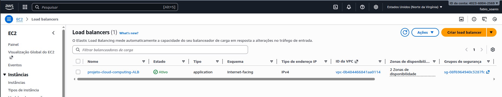
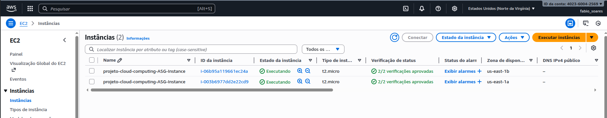

# Aluno
Fabio Silva Soares - RA: 10729833

# Solução IaC para Aplicação Web Altamente Disponível na AWS (Terraform)

Esta solução de Infraestrutura como Código (IaC) utiliza **Terraform** para provisionar uma arquitetura de aplicação web altamente disponível e escalável na AWS, conforme o diagrama abaixo:



## Arquitetura Provisionada

A arquitetura implementa os seguintes componentes:

1.  **Virtual Private Cloud (VPC):** Uma rede isolada na AWS.
2.  **Sub-redes Públicas:** Duas sub-redes em Zonas de Disponibilidade (AZs) diferentes para o Application Load Balancer (ALB).
3.  **Sub-redes Privadas:** Duas sub-redes em Zonas de Disponibilidade (AZs) diferentes para as instâncias EC2 (melhor prática de segurança).
4.  **Internet Gateway (IGW):** Permite a comunicação entre a VPC e a internet.
5.  **Security Group (SG):** Grupo de segurança para permitir tráfego HTTP (80), HTTPS (443) e SSH (22).
6.  **Application Load Balancer (ALB):** Distribui o tráfego entre as instâncias EC2.
7.  **Launch Template (LT):** Define a configuração das instâncias EC2 (AMI, tipo, `user_data` para instalar o Apache).
8.  **Auto Scaling Group (ASG):** Gerencia a frota de instâncias EC2, garantindo alta disponibilidade e escalabilidade.
    *   Configurado para manter um mínimo de 2 e máximo de 4 instâncias.
    *   Utiliza as sub-redes privadas.
9.  **Políticas de Escalonamento:** Políticas baseadas na utilização da CPU (aumenta se > 80%, diminui se < 30%).
10. **Amazon Route 53 (Opcional):** Um bloco de código comentado está incluído para configurar um registro `A` apontando para o ALB, caso seja configurado um Hosted Zone existente, o que não foi feito nesta atividade.

## Pré-requisitos

*   Conta AWS configurada.
*   AWS CLI configurado com credenciais de acesso.
*   Terraform instalado.
*   Um par de chaves SSH (key pair) na AWS (o nome padrão é `my-key-pair`).
Chave SSH usada nas instâncias EC2:


## Como Usar

1.  **Clone o repositório:**

    Arquivos fornecidos: `main.tf`, `providers.tf`, `variables.tf` e `terraform.tfvars`. Estão localizados na pasta \`terraform_scripts\`.

3.  **Inicialize o Terraform:**

    ```bash
    terraform init
    ```

4.  **Planeje a Execução:**

    ```bash
    terraform plan
    ```

5.  **Aplique a Configuração:**

    ```bash
    terraform apply
    ```
    Digite `yes` para confirmar a criação dos recursos.

6.  **Acesse a Aplicação:**

    Após a conclusão, o nome DNS do Application Load Balancer será exibido na saída. Use-o para acessar a aplicação web:

    ```bash
    terraform output alb_dns_name
    ```

7.  **Destrua a Infraestrutura (Opcional):**

    Para evitar cobranças, podemos destruir todos os recursos criados:

    ```bash
    terraform destroy
    ```
    Digite `yes` para confirmar a destruição.

## Estrutura de Rede

| Recurso | CIDR | Zona de Disponibilidade | Uso |
| :--- | :--- | :--- | :--- |
| **VPC** | 10.0.0.0/16 | - | Rede principal |
| **Sub-rede Pública 1** | 10.0.1.0/24 | AZ 1 | ALB |
| **Sub-rede Pública 2** | 10.0.2.0/24 | AZ 2 | ALB |
| **Sub-rede Privada 1** | 10.0.101.0/24 | AZ 1 | Instâncias EC2 (ASG) |
| **Sub-rede Privada 2** | 10.0.102.0/24 | AZ 2 | Instâncias EC2 (ASG) |


# Configurações
Ubuntu 25.04 = ami-01f939902904966ba

[Fonte](https://cloud-images.ubuntu.com/locator/ec2/)

# Evidências da Execução

Execução Terraform:


LB:


EC2:


# Referências
[YouTube - Como configurar AWS para usar o Terraform](https://www.youtube.com/watch?v=2Q39eWPLVpg)
[Youtube - O que é uma VPC na AWS?](https://www.youtube.com/watch?v=44--QPZbUZ0)
